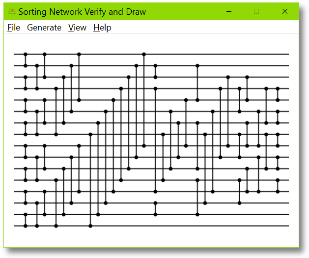

# Sorting Network Viewer

  

The source code for this sorting network viewer is written and maintained by
[Ian Parberry](http://ianparberry.com). See 
[https://ian-parberry.github.io/sortingnetworkviewer/](https://ian-parberry.github.io/sortingnetworkviewer/)
for code documentation.

## Requirements

Windows 10 and Visual C++.
This code has been tested with Visual Studio 2019 Community under Windows 10.

## License

This project is released under the
[MIT License](https://github.com/Ian-Parberry/sortingnetworkviewer/blob/master/LICENSE).